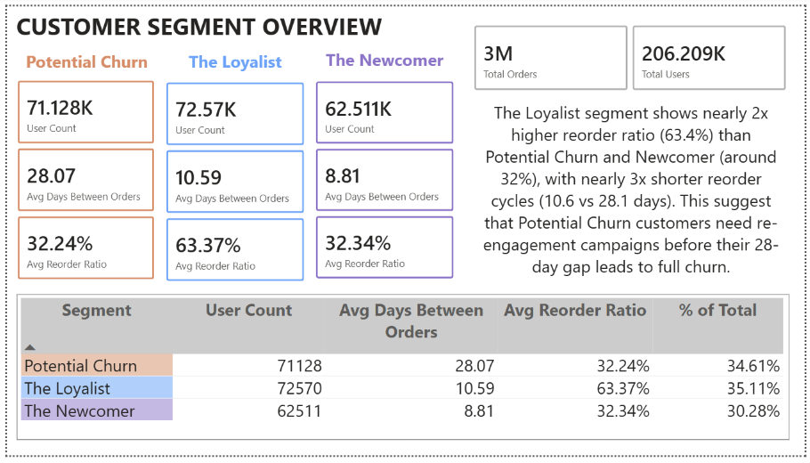
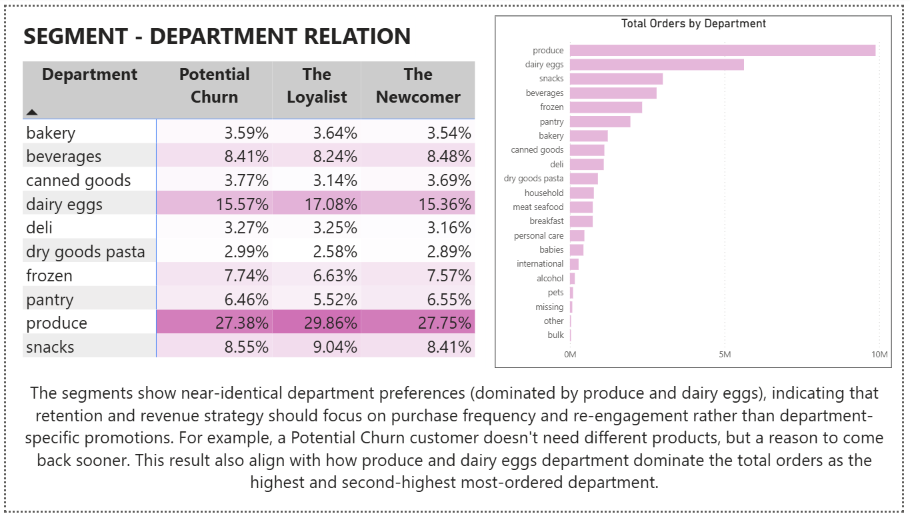

# Instacart Customer Segmentation Analysis
An end-to-end customer segmentation pipeline built based on 32M+ Instacart grocery transactions data. This includes raw SQL analysis, K-Means clustering model in Python, and a Power BI dashboard for business reporting.

## Main Question
**How can Instacart use customer purchasing behaviour to identify at-risk customers and increase reorder revenue?**


## Analytical Pipeline

| Layer | Method | Tool |
|-------|--------|------|
| Exploratory Data Analysis | Distribution analysis, data quality validation | Python |
| Customer Segmentation | RFM-inspired K-Means Clustering | Python |
| Business Intelligence | Peak ordering, reorder rate, RFM segmentation | SQL (PostgreSQL) |
| Reporting | Interactive segment and department breakdown dashboard | Power BI |

## Key Findings
1. **Peak activity:** Shopping activity peaks between 10AM - 4PM, with organic produce and dairy dominating reorder volume (Dairy Eggs with 67% and Beverages with 65.3% lead reorder rate by department).

2. **Three distinct customer segments** were identified via K-Means (tuned k=3, validated with elbow + silhouette methods):
| **Segment** | **Customers** | **Avg Days Between Orders** | **Avg Reorder Ratio** | **% of Total** |
|---|---|---|---|---|
| Potential Churn | 71,128 | 28.07 | 32.24% | 34.61% |
| The Loyalist | 72,570 | 10.59 | 63.37% | 35.11% |
| The Newcomer | 62,511 | 8.81 | 32.34% | 30.28% |

The Loyalist segment reorders nearly 2x more frequently than Potential Churn or The Newcomer, with a purchase cycle roughly 2.6x shorter than Potential Churn's 28-day gap.

3. **Category preferences are near-identical across segments.** Produce (~27-30%) and dairy eggs (~15-17%) dominate purchasing for all three groups, with almost no meaningful difference in what each segment buys. This indicates that retention and revenue strategy should focus on purchase frequency and re-engagement rather than department-specific promotions. For example, a Potential Churn customer doesn't need different products, they need a reason to come back sooner.
 
## Dashboard
**Page 1 - Segment Overview:** customer counts, average reorder cycle, and reorder ratio per segment, with a supporting comparison table.



**Page 2 - Segment x Department Relation:** a heatmap of purchasing category share by segment, alongside overall department order volume, surfacing the "near-identical preferences" finding above.




## Project Structure
```
instacart-customer-behaviour-analysis/
├── sql/
│   ├── 01_setup.sql                       # Schema creation and data loading
│   ├── 02_analysis.sql                    # EDA queries reorder analysis, NTILE-based RFM segmentation
│   └── 03_view_rfm_segments.sql           # Views feeding Power BI (segment overview + department relation)
├── customer_segmentation_analysis.ipynb   # EDA, feature engineering, K-Means clustering, Postgres export
├── sql_outputs/                           # SQL query result screenshots
├── notebook_outputs/                      # cluster_profile.csv
├── kmeans_tuning_results.json             # Hyperparameter tuning result
├── powerbi/
│   ├── instacart_dashboard.pbix           # Power BI report (2 pages)
│   └── data/                              # Exported CSVs backing the dashboard
├── requirements.txt
├── .gitignore
└── README.md
```

## Dataset
Instacart Online Grocery Shopping Dataset 2017  
[Download from Kaggle](https://www.kaggle.com/datasets/psparks/instacart-market-basket-analysis)

Place the CSV files inside a `/data` folder:
- `aisles.csv`
- `departments.csv`
- `orders.csv`
- `products.csv`
- `order_products__train.csv`
- `order_products__prior.csv`

## Setup

1. Clone the repository
```bash
git clone https://github.com/nivalix/instacart-customer-behaviour-analysis.git
cd instacart-customer-behaviour-analysis
```
2. Create and activate virtual environment
```bash
python -m venv .venv
# Windows
.venv\Scripts\activate
# Mac/Linux
source .venv/bin/activate
```
3. Install dependencies
```bash
pip install -r requirements.txt
```
4. Load the raw data into Postgres and run ```sql/01_setup.sql``` and ```sql/02_analysis.sql```
5. Open and run the notebook
```bash
jupyter notebook customer_segmentation_analysis.ipynb
```

This performs the EDA, feature engineering, and K-Means clustering, and (optionally) exports the final per-customer segment assignments back to Postgres via the ```customer_segments``` table (see section 3.8 of the notebook). This step requires a running Postgres instance; if you only want to produce the clustering analysis, you can stop before this cell.

6. Run ```sql/03_segment_department_relation.sql``` to create the two reporting views, then open ```powerbi/instacart_dashboard.pbix``` in Power BI Desktop to explore the dashboard, or view the exported CSVs directly in ```powerbi/data/```.

## Tech Stack
SQL (PostgreSQL) · Python (pandas, scikit-learn, matplotlib/seaborn) · Power BI · Jupyter
